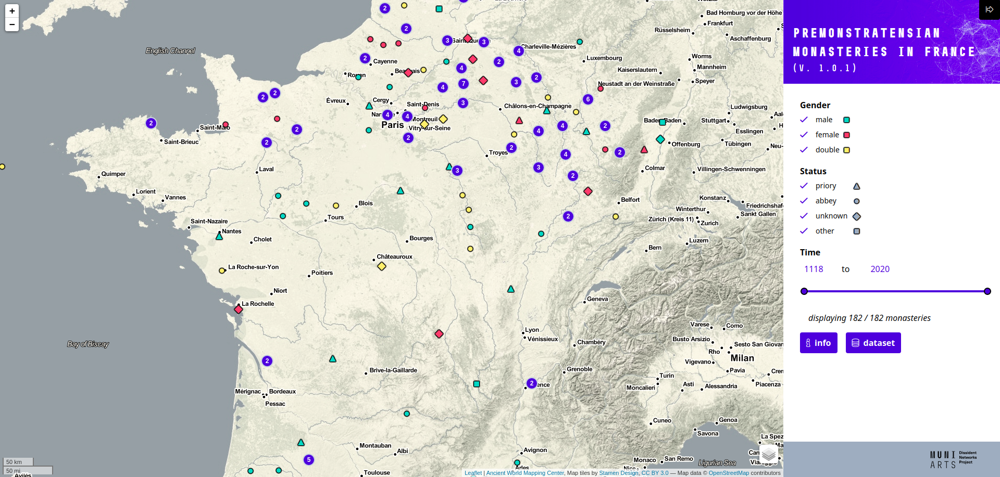

# Premonstratensian monasteries in France (from Ardura 1993)

This maps (static and interactive) visualize a dataset of Premonstratensian houses in France from the foundation of the order up to the present. The dataset is a digital adaptation and formalization of the most complete catalogue available, edited by Bernard Ardura (Abbayes, prieurés et monastères de l’ordre de Prémontré en France des origines à nos jours: Dictionnaire historique et bibliographique, 1993)

## Dataset

Data were digitized from [Ardura, 1993](https://www.zotero.org/groups/446972/dissident_networks_project/items/TSQEKMGD/) by Jaroslava Fabíková under the supervision of [David Zbíral](https://muni.academia.edu/DavidZb%C3%ADral). This
[dataset](https://docs.google.com/spreadsheets/d/1ox_Uv9xYMullKudXLFnoOgiU52QO7Sl1Dk6G6F7gg5Y/edit?usp=sharing) is published online and open to be used.

## Interactive map

Hosted under [DISSINET domain](https://dissinet.cz/maps/premonstratensiansfrance/), this map allows interactively filtering the dataset by time, the gender of the community, a choice of base maps and query the detail of the record on marker click. The map was constructed with [react-leafltet](https://react-leaflet.js.org/) and [tailwindcss](https://tailwindcss.com/).

## Static map

This static map was created in QGIS, and it is the appendix of the [Bachelor's thesis of Jaroslava Fabíková](https://is.muni.cz/auth/th/luecq/?lang=en).

## DISSINET

This is a side-activity of the project of [Dissident Networks Project (DISSINET)](dissinet.cz) at the [Masaryk University, Brno](https://www.muni.cz/en). The project received funding from the Czech Science Foundation (project No. GX19-26975X “Dissident Religious Cultures in Medieval Europe from the Perspective of Social Network Analysis and Geographic Information Systems”). We gratefully acknowledge this financial support.
